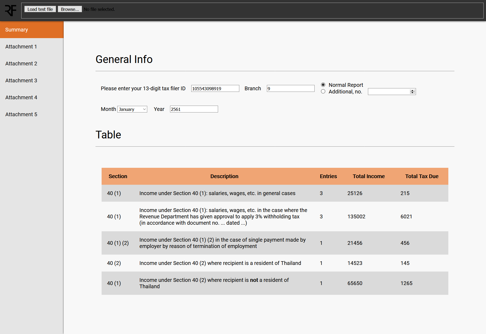

# RDTaxFiler

Proof-of-concept web-based tax filing program for PND. 1 form (Thailand)

# Privacy Notice

I've been assured by the person who generated the example file that it contains no real identifiable information, as in, the file was randomly generated. That was years ago, so if this turns out to not be the case, please notify me and I'll remove the demo file.

# Highlights

- Reverse engineering of a proprietary file storage format by fuzzing input
- Detailed documentation accompanying the results (see `docs/`)
- Usage of HTML/CSS/TypeScript

Final cleanup aside, *I did most of this project in high school, not long after I started programming. That should explain the code quality.*

**To inspect the demo file, once it's been loaded, type `rdf.file` into the browser console.**

# Requirements

If your browser version is newer than early 2016, it will probably work.

- JavaScript enabled
- ECMAScript 6
- CSS3
- Development: TypeScript compiler
- To build, transpile to JS then run a web server in this folder.

# Gallery

